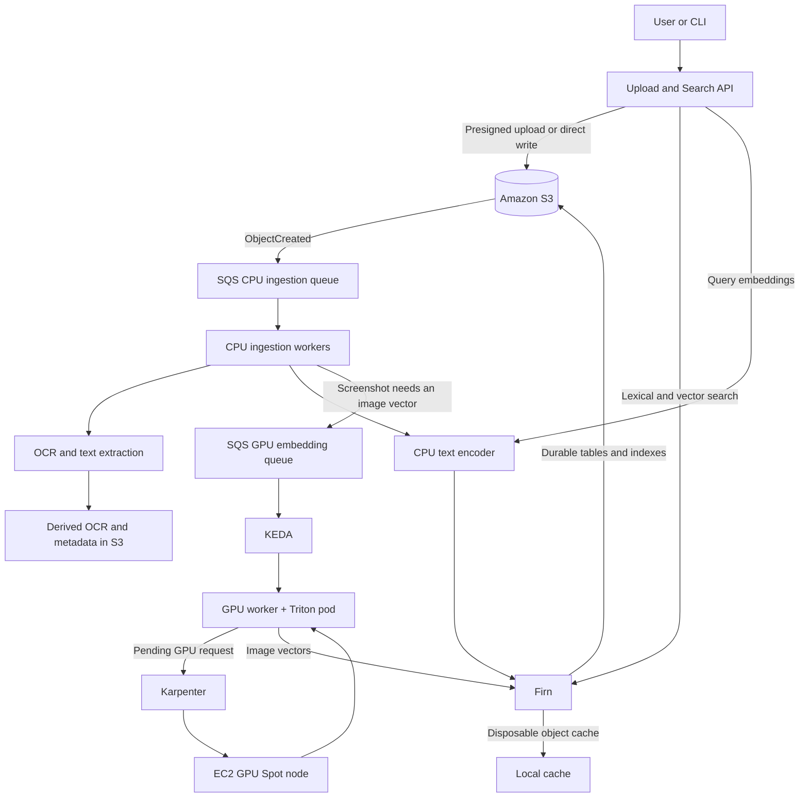

# MetaBare

A cost-aware, scale-to-zero multimodal retrieval system on Amazon EKS, using
[Firn](https://github.com/gordonmurray/firnflow) and Amazon S3 as the storage
and retrieval layer.

> **Status: early.** Note ingestion and hybrid search run on
> EKS, with Firn backed by S3 and no static AWS credentials anywhere. There is
> no GPU path, no OCR, no autoscaling and no benchmark data yet. Nothing here
> claims a measured performance or cost result that has not actually been
> measured, and the benchmark sections below say "planned" for that reason.

## The problem

I have thousands of technical screenshots and notes: terminal captures, AWS
console screens, Kubernetes dashboards, architecture diagrams, error messages
I meant to come back to. Finding one again means scrolling through a folder by
date and hoping.

MetaBare makes them searchable by what is *in* them:

```text
Find the screenshot containing the DocumentDB index error.
Show notes about EKS Spot interruptions.
Where did Terraform fail to delete a resource?
```

It is also a deliberate excuse to answer some questions with evidence rather
than opinion: what event-driven GPU inference on Kubernetes actually costs,
how long "scale to zero" really takes to come back from zero, and whether an
object-storage-backed search engine is a reasonable substitute for a
managed search cluster at small scale.

## Architecture



The load-bearing constraint is that **the query path never touches a GPU**.
Text embedding for search runs on CPU, so the system stays searchable when no
GPU node exists — which is most of the time. GPUs are for batch image
encoding and nothing else.

## Why these components

| Component | Why |
| --- | --- |
| **Firn on S3** | Search indexes live in object storage, with local disk as a disposable cache. Idle cost is close to storage cost, which is the interesting property to test against a managed cluster that bills per hour whether queried or not. |
| **S3** | The source of truth. Compute and caches are meant to be destroyable without data loss. |
| **Triton** | The GPU inference server for batch OpenCLIP image encoding: model loading, readiness reporting, dynamic batching and Prometheus metrics without writing that layer by hand. |
| **KEDA** | Scales the GPU worker from zero on SQS queue depth, so idle means zero pods rather than one idle pod. |
| **Karpenter** | Removes the GPU node once the pod is gone. Without this, "scale to zero" is just an idle instance still being billed. |
| **ONNX Runtime** (not PyTorch) for the CPU encoder | A torch image is roughly 2 GB and drags in CUDA wheels a CPU node will never use. Image size is `container_image_pull_seconds` in the cold-start budget. |

## What it costs to run

The dev environment costs about **$145 a month idle**, before anything is
ingested.

### Dev environment, idle

| Resource | Detail | Monthly |
| --- | --- | --- |
| EKS control plane | 1 cluster at $0.10/hour. Bills whether or not anything runs on it | **$73.00** |
| Stable node | 1 × `t3.large` On-Demand | **$66.58** |
| EBS root volume | 40 GiB gp3 at $0.088/GB-month | **$3.52** |
| KMS key | Secret envelope encryption, created by the EKS module | **$1.00** |
| ECR image storage | ~128 MB per deployment, lifecycle keeps the newest 10 | **$0.13** |
| S3 storage and requests | ~10 GB, ~200k requests | **$0.63** |
| SQS, VPC, S3 gateway endpoint, CloudWatch log group, Budget | | **$0.00** |
| **Total** | | **≈ $144.86** |

Not created: NAT Gateway ($35.04/mo, an S3 gateway endpoint is free and
carries the workload's main dependency), interface VPC endpoints ($8.03/mo
each per AZ), a load balancer (~$18/mo), multi-AZ node groups, and any GPU
capacity.

Prices are `eu-west-1` list prices from the AWS Price List API, queried
2026-07-29, excluding VAT, Savings Plans, credits and the free tier.
Reproduce them with:

```bash
AWS_PROFILE=<profile> uv run --with boto3 python scripts/aws-prices.py
```

At roughly $0.20/hour all-in, `make destroy` between sessions brings a cluster
used 20 hours a week to about $16/month.

### Guardrails

Always on: Karpenter limits on every NodePool, a maximum GPU replica count of
one, and a CI check that fails the build on an unbounded NodePool, a
`ScaledObject` that does not scale to zero, or a NAT Gateway added without an
explicit cost acknowledgement.

Budget alerting is opt-in. No AWS Budget is created unless you set
`budget_alert_email`. With it set, you get alerts at 80% of actual spend and
100% of forecast:

```bash
terraform -chdir=infra/environments/dev apply -var 'budget_alert_email=you@example.com'
```

`terraform output budget_alerting` reports whether a budget exists, so this is
visible rather than something you assume you configured. Left unset, nothing
tells you the cluster is still running.

The local development stack costs nothing and needs no AWS account.

## Quick start (local, no AWS account)

```bash
uv sync --all-extras          # Python 3.12 toolchain and dependencies
docker compose up -d          # MinIO, Firn, API
make smoke                    # ingest a note, search for it, assert the round-trip
```

Then:

```bash
curl -s localhost:8080/v1/notes -H 'content-type: application/json' \
  -d '{"body":"# EKS Spot\nNode drained after a 2 minute interruption notice."}' | jq .

curl -s 'localhost:8080/v1/search?q=spot+interruption' | jq '.hits[] | {title, retrieval_path, score}'
```

The API is at `http://localhost:8080`, Firn at `http://localhost:3000`, MinIO's
console at `http://localhost:9001`.

## Deployment and teardown

First, point Terraform at a state bucket of your own:

```bash
cp infra/environments/dev/backend.hcl.example infra/environments/dev/backend.hcl
$EDITOR infra/environments/dev/backend.hcl
```

The bucket must already exist, because Terraform cannot create the bucket that
holds its own state. Credentials come from the standard AWS credential chain,
so `AWS_PROFILE` works as usual; set `aws_profile` in the config if you would
rather pin it.

Then set a budget alert address, so nothing runs unwatched:

```bash
echo 'budget_alert_email = "you@example.com"' > infra/environments/dev/terraform.tfvars
```

```bash
make init ENV=dev      # uses backend.hcl
make plan ENV=dev      # read "What it costs to run" above first
make apply ENV=dev     # ~$145/month idle, from the moment it succeeds
make deploy ENV=dev    # build, push to ECR, roll out Firn and the API
make destroy ENV=dev   # removes everything, including the data bucket
```

`make destroy` really does remove everything. The data bucket is created with
`force_destroy = true`, so it is deleted along with whatever it contains,
without prompting. That is deliberate for a lab holding synthetic data: a
teardown that fails the moment the system has been used is not a teardown, and
a half-destroyed environment keeps billing. Set `bucket_force_destroy = false`
for any environment holding data you would miss.

Then verify with the *same* smoke test the local stack uses:

```bash
kubectl -n metabare port-forward svc/api 8080:8080 &
API_URL=http://localhost:8080 ./scripts/smoke.sh
```

That the smoke test is unchanged between Compose and EKS is the point: the
seam sits at the object-storage API, and nothing above it differs between the
two. MinIO stands in for S3 locally; everything else is the same code with the
same configuration.

What that boundary deliberately does *not* cover, and what therefore only gets
proven on a real deployment: IAM and Pod Identity, SQS delivery semantics,
Karpenter, KEDA, Spot interruption, GPU scheduling, and container image pull
time.

Terraform applies with `-parallelism=1`. That is not caution. At the default
parallelism the AWS provider in this environment returned a 302 on
`iam:CreateRole`, a parse failure on `CreateVpc`, and an
`InvalidSignatureException` on a plain read, while the same calls through the
AWS CLI succeeded every time. Serialising fixed it.

## Benchmarks

Planned, with methodology fixed before results are collected:

- **Cold start**: the full path from queued work to first searchable image
  vector, broken into its twenty constituent timestamps.
- **GPU family**: G4dn vs G5 vs G6 by cost per 1,000 screenshots, not by
  hourly price.
- **Firn vs OpenSearch**: same corpus, same queries, same judgements.
- **S3 lifecycle**: whether transitions save money once transition and
  retrieval fees are counted.

No results are published here until the raw data is committed alongside them.
Claims will be scoped to the tested workload, region, model, dataset,
configuration and date.

## Honest limitations

- Firn stores four columns and no arbitrary metadata (`id`, one vector field,
  an optional `text`, and a server-set `_ingested_at`), so all item metadata
  lives in S3 and rendering a result costs an extra GET per hit.
- Retrieval quality has not been measured. There is no golden dataset and no
  relevance judgements yet, so "it works" currently means "it returns
  plausible results", which is not the same thing.
- Single-writer assumptions have not been stress-tested. Firn documents
  compare-and-swap safety for concurrent writers; MetaBare has not verified it.
- This is a lab, not a production service. High availability is deliberately
  absent, and what would change for production is documented rather than built.

## Design notes

A few decisions that are not obvious from the code:

**All item metadata lives in S3, not in Firn.** A Firn row has four columns and
no room for a content type, an S3 key or an ingestion state. Record documents
are keyed by the hex form of the Firn row id, so a search hit resolves to an S3
key with no lookup table and no join.

**Two identities, not one.** Item identity is derived from bucket, key, version
id and content hash, and deliberately ignores pipeline and model versions, so
reprocessing lands on the same Firn row and replaces it. Processing identity
adds those versions, so a version bump is detectable and triggers a controlled
re-index. One identity cannot serve both.

**Results are merged with Reciprocal Rank Fusion, not score normalisation.** A
vector query returns an L2 distance where lower is better; BM25 returns
relevance where higher is better; their ranges depend on dimension and corpus
statistics. Min-max normalising them produces a number that looks comparable
and is not. RRF uses only rank. The cost is that the score has no absolute
meaning, only an ordering, which is what the `score_explanation` field on every
hit says.

**Three Firn namespaces, not one.** A namespace holds exactly one vector field
whose kind and dimension are fixed by its first write, so `notes-text`,
`screenshots-text` and `screenshots-image` are separate.

### Previous incarnation

Before this rebuild, metabare.com was a Firn-on-S3 **image** search demo
(CLIP and ColPali over a COCO corpus, on a single EC2 instance). That code is
preserved on the `archive/image-search-showcase` branch and tagged
[`v0.1.0-image-search`](https://github.com/gordonmurray/metabare.com/releases/tag/v0.1.0-image-search).
